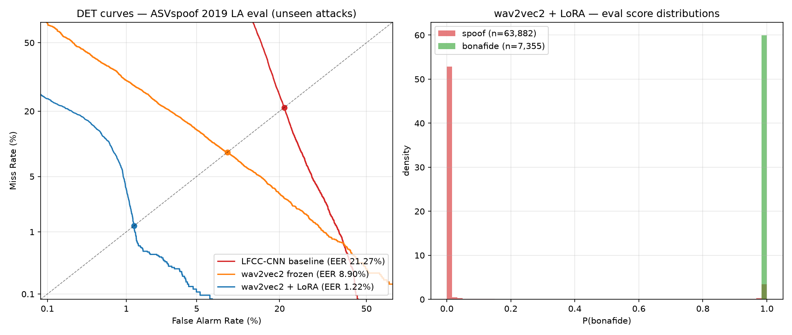

# Speech Deepfake Detection: Classical DSP vs. Self-Supervised Representations

Detecting spoofed/synthetic speech on ASVspoof 2019 (Logical Access), comparing a
classical signal-processing baseline (LFCC + CNN) against a LoRA-fine-tuned
wav2vec2 model. Evaluated with Equal Error Rate (EER).

| Model | Trainable params | Dev EER | Eval EER (unseen attacks) |
|-------|------------------|---------|---------------------------|
| LFCC-CNN baseline | ~470K | 0.27% | 21.27% |
| wav2vec2-base frozen + head | 197K | 4.18% | 8.90% |
| wav2vec2-base + LoRA (r=8) | 492K (0.5% of model) | **0.13%** | **1.22%** |

## Project Structure
- `src/` — data pipeline, features, models, training, evaluation
- `configs/` — central configuration
- `notebooks/` — Colab/Kaggle training notebooks
- `results/` — metrics, figures, score files

## Dataset
ASVspoof 2019 LA. Audio files are not committed; see setup instructions.
## Results

Evaluated with Equal Error Rate (EER). Dev shares attack types with training
(A01–A06); Eval contains only unseen attacks (A07–A19), making it the true
test of generalization.

| Model | Frontend | Dev EER | Eval EER (unseen attacks) |
|-------|----------|---------|---------------------------|
| CNN baseline (5 epochs, T4) | LFCC (60 + Δ + ΔΔ) | 0.27% | **21.27%** |
| wav2vec2-base frozen + head | raw waveform | 4.18% | 8.90% | 
| wav2vec2-base + LoRA | raw waveform | TBD | TBD |

**Key finding so far:** the classical-feature baseline achieves near-perfect
performance on seen attacks but degrades ~79x on unseen attacks — it memorizes
attack-specific artifact signatures rather than learning a general notion of
synthetic speech. This generalization gap motivates the self-supervised
frontend experiments below. 
## Practical Notes

- **Kaggle P100 incompatibility:** Kaggle's current PyTorch builds no longer
  support the P100 (CUDA capability sm_60). Use the T4 x2 accelerator instead.
- **Dataset mount path:** the awsaf49 ASVspoof mirror mounts double-nested
  (`.../asvpoof-2019-dataset/LA/LA/`); `src/data.py` auto-detects the root.
- **Repeat-padding, not zero-padding:** short clips are tiled to 4s, preserving
  vocoder artifact density rather than diluting it with silence.
- Training runs on fp16 (T4 has no bf16 tensor core support in this config).
"Kaggle version outputs snapshot only the current session's /kaggle/working — carry artifacts forward before saving."